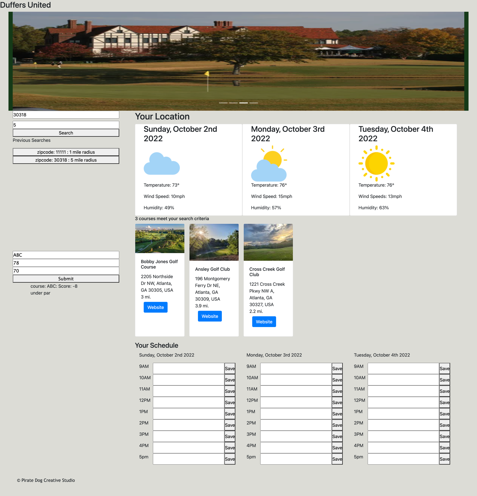

# Golf All

## Description
The site is used for avid golfers who want to find or explore their local golf courses. It has a schedule function and shows the weather for the next few days to plan one's next golf session.
## Installation
N/A
## Usage
The user will start their search by inputing some criteria (location and desired search radius). After clicking the submit button the page will populate with the future forecast and all the golf courses that fit their criteria. The golf courses listed will also have their URL so one can explore their site. There is a schedule that individuals can see when they have time to have a quick golf session. Lastly in the sidebar there is a section that allows the user to store their previous scores and see how well they did. 

All information entered in the search bars and score card sections are stored and displayed for when the user returns to the website.

## Credits
https://rapidapi.com/golfambit-golfambit-default/api/golf-course-finder
Golf Course Finder API

https://openweathermap.org/api
Weather API

https://www.geocod.io/
GeoCode API
## License
N/A

## Link to Application
[Link to Application](https://hdyoung21.github.io/Golf-All/) 
